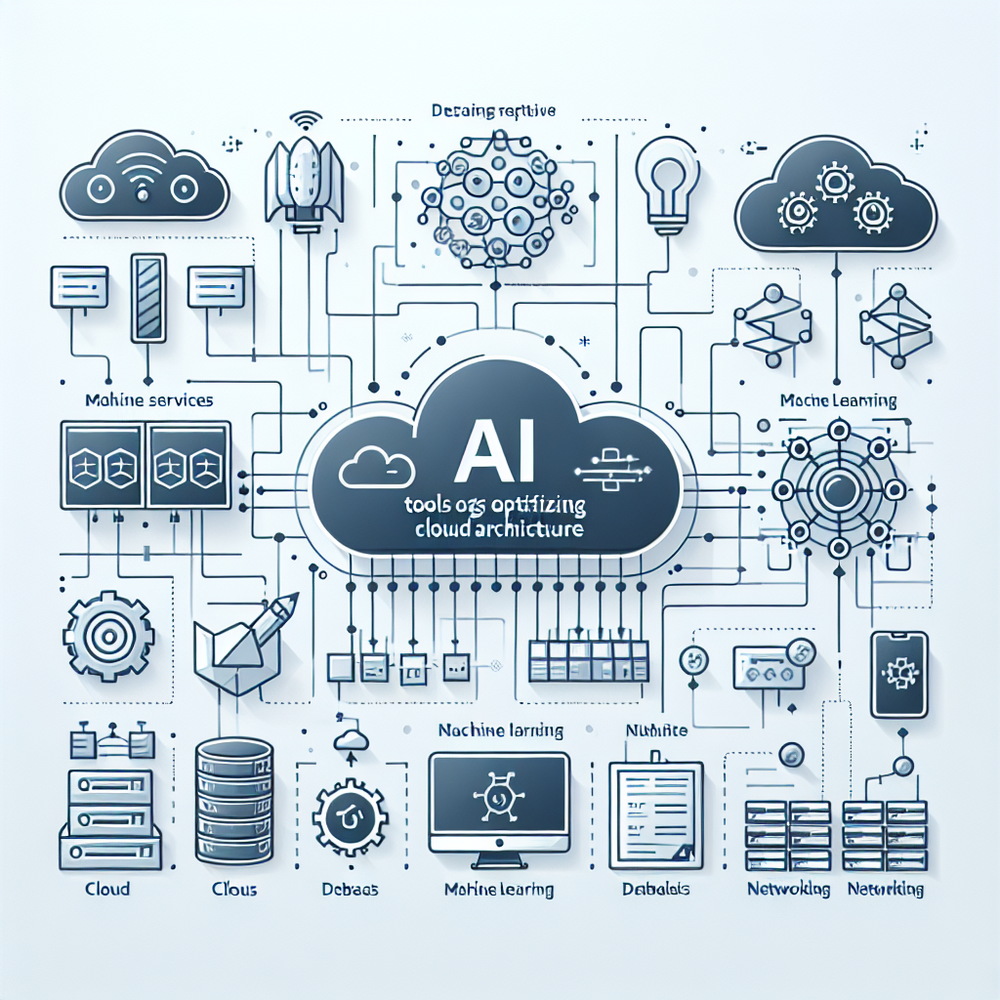

# 02. Servicios esenciales: Compute, Storage y Bases de Datos

- [Introducción](#introducción)
- [Compute Engine, App Engine y Cloud Run](#compute-engine-app-engine-y-cloud-run)
- [Cloud Storage: buckets, clases de almacenamiento y políticas de acceso](#cloud-storage-buckets-clases-de-almacenamiento-y-políticas-de-acceso)
- [Cloud SQL y Firestore: uso, creación y conexión desde aplicaciones Python](#cloud-sql-y-firestore-uso-creación-y-conexión-desde-aplicaciones-python)
- [IA integrada: generación de scripts, conversión de código y apoyo al diseño de arquitecturas](#ia-integrada-generación-de-scripts-conversión-de-código-y-apoyo-al-diseño-de-arquitecturas)
- [Recursos adicionales](#recursos-adicionales)

## Introducción
En esta lección, exploraremos los servicios esenciales de Google Cloud Platform que son fundamentales para el despliegue de aplicaciones: Compute Engine, App Engine, Cloud Run para procesamiento; Cloud Storage para almacenamiento; y Cloud SQL junto con Firestore para gestión de bases de datos. Además, discutiremos cómo la inteligencia artificial integrada puede optimizar estos procesos.

## Compute Engine, App Engine y Cloud Run
Google Cloud Platform ofrece varias opciones para ejecutar aplicaciones, cada una con sus propias características y casos de uso ideales.

**Compute Engine** es una infraestructura como servicio (IaaS) que permite crear y gestionar máquinas virtuales. Es adecuado para aplicaciones que requieren el control total del entorno de ejecución.

**App Engine** es una plataforma como servicio (PaaS) que facilita el despliegue de aplicaciones escalables sin necesidad de gestionar la infraestructura subyacente. Es ideal para aplicaciones web con patrones de tráfico variables.

**Cloud Run** ofrece un entorno serverless para ejecutar contenedores. Es perfecto para aplicaciones basadas en microservicios y cargas de trabajo event-driven.

La elección del servicio adecuado depende del nivel de control necesario, la naturaleza de la aplicación y los patrones de tráfico esperados.
## Cloud Storage: buckets, clases de almacenamiento y políticas de acceso
**Cloud Storage** es el servicio de almacenamiento de objetos de Google Cloud, diseñado para almacenar y acceder a datos de manera segura y eficiente.

Los datos se organizan en **buckets**, que actúan como contenedores para los objetos. Cada bucket tiene configuraciones de acceso y políticas de retención específicas.

Cloud Storage ofrece diferentes **clases de almacenamiento**: estándar, nearline, coldline y archive, cada una optimizada para distintos patrones de acceso y costos.

Las **políticas de acceso** permiten definir quién puede ver y modificar los datos dentro de un bucket, cumpliendo con las normas de seguridad y privacidad.
## Cloud SQL y Firestore: uso, creación y conexión desde aplicaciones Python
**Cloud SQL** y **Firestore** son servicios de bases de datos gestionados que facilitan la creación y administración de bases de datos relacionales y NoSQL, respectivamente.

**Cloud SQL** soporta MySQL, PostgreSQL y SQL Server, proporcionando una gestión simplificada de bases de datos relacionales. Se integra fácilmente con aplicaciones Python a través de bibliotecas como `psycopg2` y `mysql-connector-python`.

**Firestore** es una base de datos NoSQL que ofrece sincronización en tiempo real y escalabilidad automática. Es ideal para aplicaciones que requieren alta disponibilidad y baja latencia.

Para conectar aplicaciones Python a estos servicios, se utilizan las bibliotecas cliente de Google Cloud, que proporcionan métodos para autenticación y operaciones CRUD.
## IA integrada: generación de scripts, conversión de código y apoyo al diseño de arquitecturas
La **inteligencia artificial integrada** en Google Cloud puede facilitar tareas complejas como la generación automática de scripts de configuración, la conversión de código entre diferentes lenguajes y el diseño de arquitecturas eficientes.

Utilizando herramientas de IA, los desarrolladores pueden automatizar la configuración de recursos y optimizar el uso de servicios, mejorando la productividad y reduciendo la probabilidad de errores.

Además, estas herramientas pueden proporcionar recomendaciones sobre la arquitectura de las aplicaciones, sugiriendo mejoras en la escalabilidad, eficiencia y costos.

## Recursos adicionales
> **Enlaces externos**: Los enlaces se abren en la misma pestaña. Usa Ctrl+Click (Windows/Linux) o Cmd+Click (Mac) para abrirlos en pestaña nueva.

- <a href="https://cloud.google.com/docs" target="_blank">Google Cloud Platform Documentation</a>
- <a href="https://googleapis.dev/python/" target="_blank">Python Client for Google Cloud</a>
